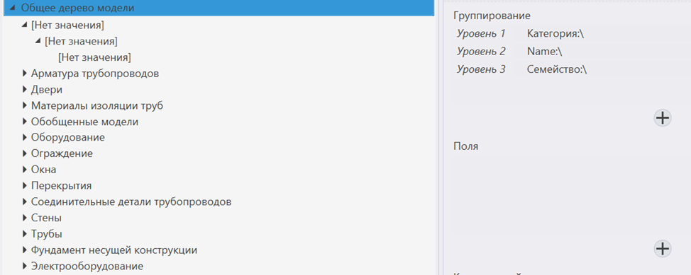
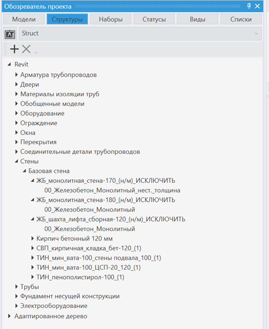
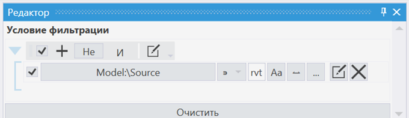

### Пользовательское дерево модели

1. Сводная ЦИМ из одного САПР

2. Сводная ЦИМ из разного САПР

Если сгруппировать по параметрам, которые есть только в модели из одного САПР, то дерево будет неинформативным: для других моделей дерево формировать не будет из-за отсутствия параметров.

{width=974px height=389px}

**Существует два способа, как корректно построить дерево модели в таком случае:**

-  На каждый формат модели своё дерево

-  Адаптировать модель и получить единое дерево

1. ЦИМ из revit

{width=551px height=673px}



---

*  

   шаг

*  

   Описание

---

*  

   1

*  

   Отфильтруем модели только из Revit

   {width=680px height=197px}

   *Ссылка на инструкцию как создать фильтр*

---

*  

   2

*  

   Настроим пользовательскую группировку дерева.

   Например, по категории, имени семейства, имени типоразмера, материалу

   *Ссылка на инструкцию как создать группировку*



1. IFC-моделей

2. ЦИМ другого формата

### Визуальная проверка значений параметров

например, Этаж

### Визуальная проверка объема моделирования

по классам/категориям элементом/любому параметру

### Визуальная проверка положения элементов относительно всей модели:

Визуализировать всю модель, после двойного клика по «ветке» идет перестройка окна Элементы, визуализация остается прежняя, выделить все элементы в окне Элементы